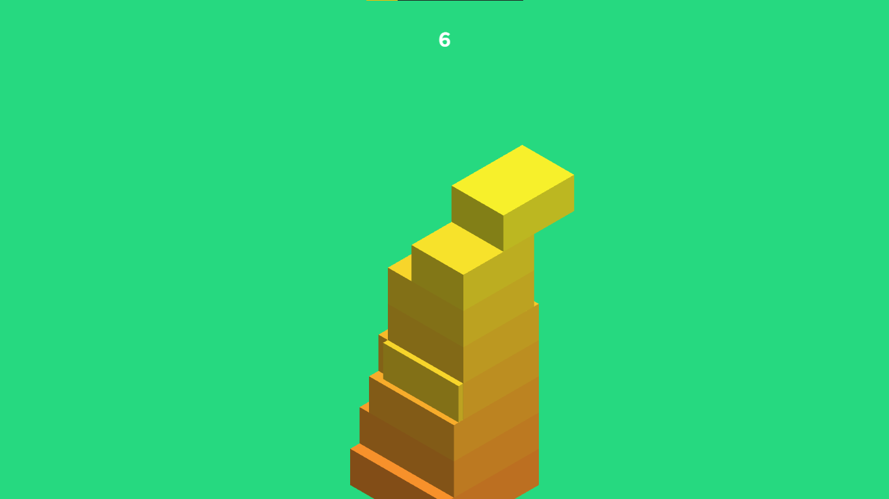

> Finding support and maintenance
>
> Collab with us [ISSUES](https://github.com/ZhengLinLei/stackblock.io/issues) and FORK

<h1 align="center">StackBlock.io</h1>
<br>
<br>
<br>

Live web preview [here](https://zhenglinlei.github.io/stackblock.io)

<p align="center">
    
</p>

<br>

<p align="center">
  <a href="./CONTRIBUTING.md">Contributing</a>
  ·
  <a href="https://github.com/ZhengLinLei/stackblock.io/issues">Issues</a>
</p>

<p align="center">
  <a href="https://opensource.org/licenses/Apache-2.0">
    
  </a>&nbsp;
  <a>
    
  </a>
</p>

<hr>

## 📁 Source Code

The main project file code in `./js/script.js`.

This project was made with the help of:

    * Three.js
    * Cannon.js


CDN:
```HTML
<script src="https://cdnjs.cloudflare.com/ajax/libs/three.js/r128/three.min.js" integrity="sha512-dLxUelApnYxpLt6K2iomGngnHO83iUvZytA3YjDUCjT0HDOHKXnVYdf3hU4JjM8uEhxf9nD1/ey98U3t2vZ0qQ==" crossorigin="anonymous" referrerpolicy="no-referrer"></script>

<script src="https://cdnjs.cloudflare.com/ajax/libs/cannon.js/0.6.2/cannon.min.js" integrity="sha512-avLcnGxl5mqAX/wIKERdb1gFNkOLHh2W5JNCfJm5OugpEPBz7LNXJJ3BDjjwO00AxEY1MqdNjtEmiYhKC0ld7g==" crossorigin="anonymous" referrerpolicy="no-referrer"></script>
```


## 🎮 Bot testing

To activate the bot testing, you only need to write in console `playBot([relation:float], [time:int])`, by default the parameters are *0.9* and *20ms*

Or you can set it manually:
```javascript
let botTimer = setInterval(()=>{
        
    const lastLayer = stackBoxArr[stackBoxArr.length -1];
    const previousLayer = stackBoxArr[stackBoxArr.length -2];
    
    // LAST LAYER DIRECTION
    let lastDirection = lastLayer.direction;
    
    // CALCULATE OUTBOX 
    let delta = lastLayer.threejs.position[lastDirection] - previousLayer.threejs.position[lastDirection] // !NOTE: THE BOTH BOX MUST BE CALCULATED WITH THE SAME DIRECTION
    let alpha = Math.abs(delta); // GET POSITIVE NUM
    
    // CALCULATE OUTBOX WIDTH DEPTH
    let outbox = (lastDirection === "x")? lastLayer.width : lastLayer.depth;
    let inbox = outbox - alpha;
            
    const boxRelation = inbox / outbox; // 0 to 1
    if(boxRelation >= 0.9){
        document.body.click();
                
        console.log(boxRelation); // OUTPUT
    }
    
}, 20);
```


### Love this repo? Give us a star ⭐

<a href="./">
  
</a>
